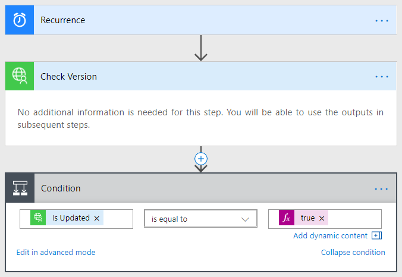
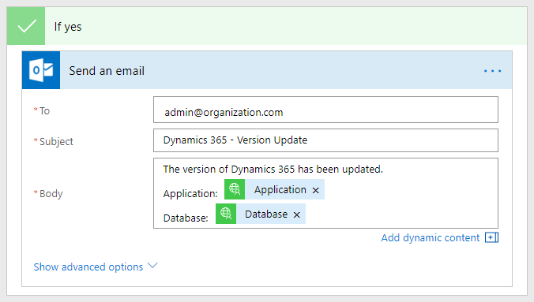
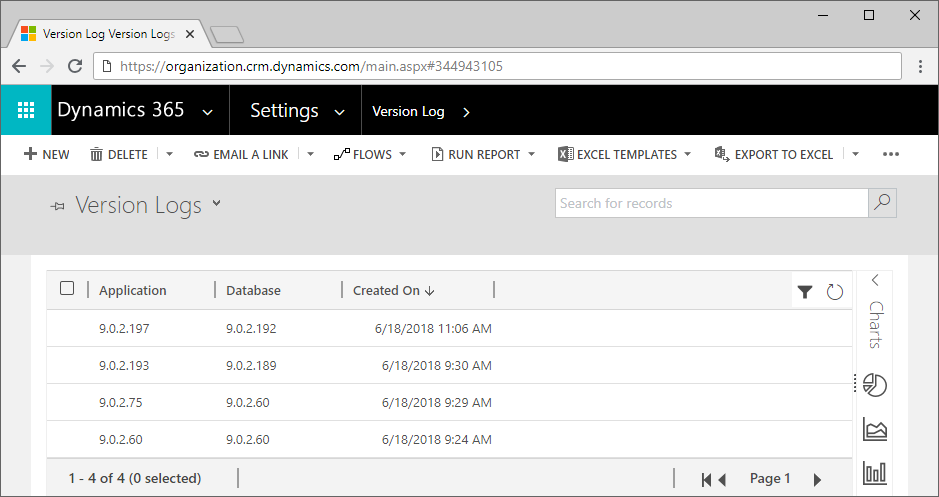

# Utilities

This repository contains various utility projects for Dynamics 365.

## Version Monitor
Microsoft occasionally updates the revision of Dynamics 365 without notice.  They do this to fix bugs and patch security holes, and while it's great that they do this, occasionally the patches cause inadvertent issues.

With this solution, you can create a Flow to perform any action (e.g. send an email) whenever the revision number has changed!  For example:

   

   

As an added bonus, the solution will also track the history of version changes!

   

### Configuration

Please refer to the [installation](./docs/INSTALL.md) documentation.